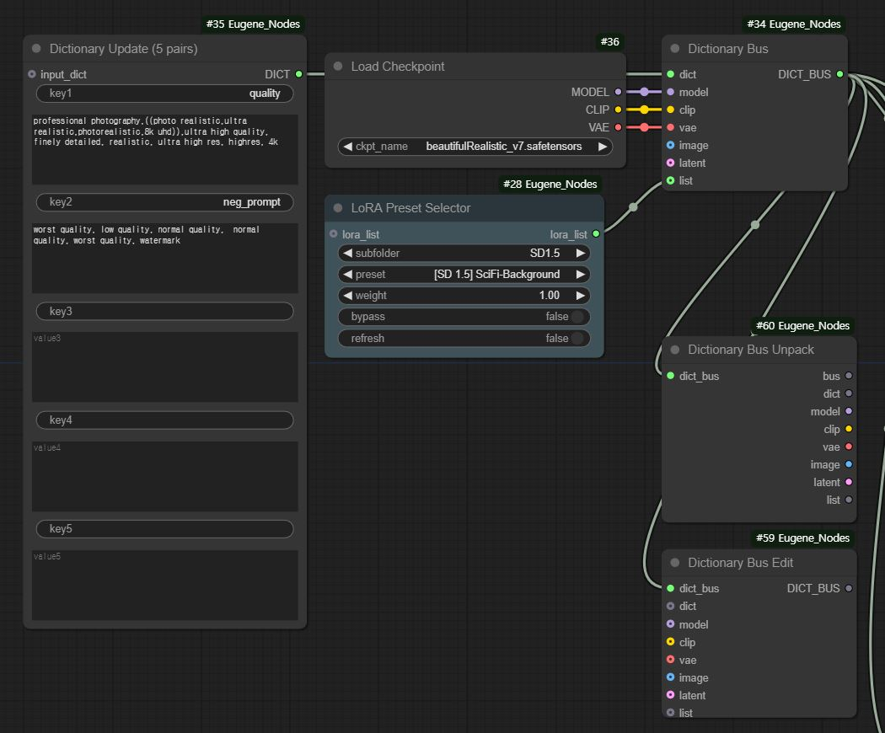
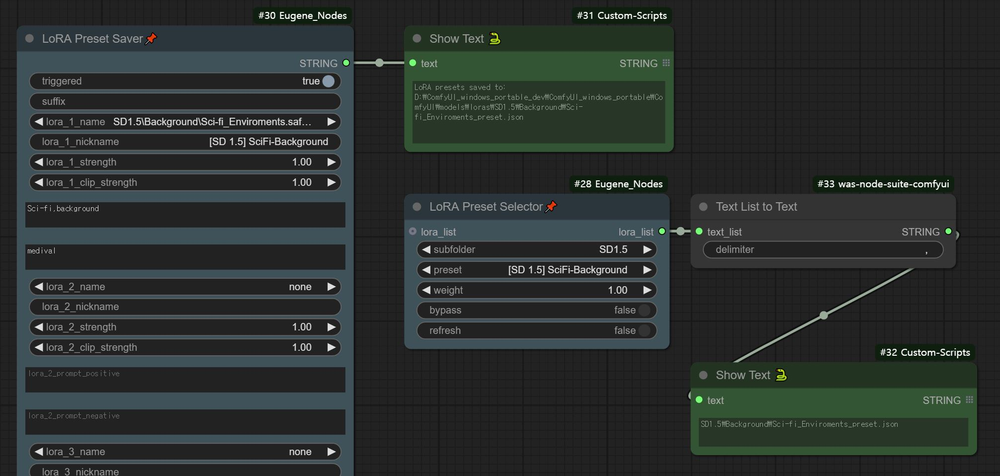
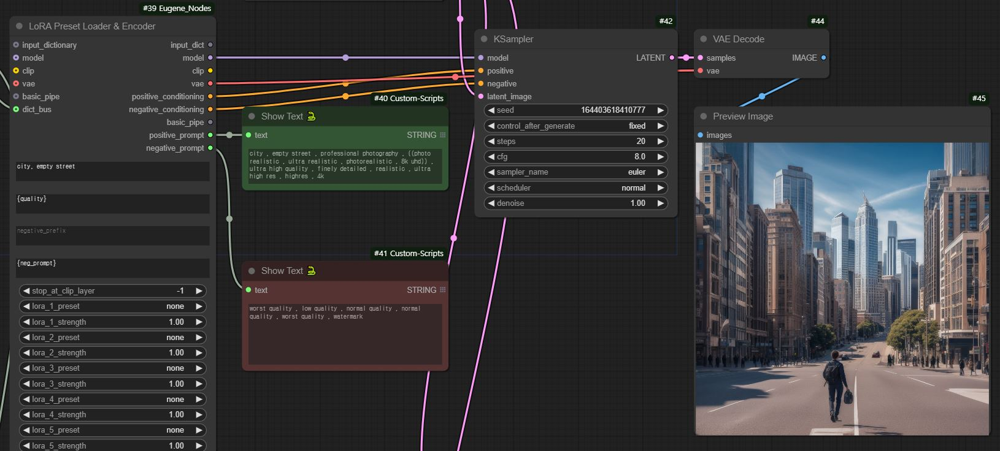
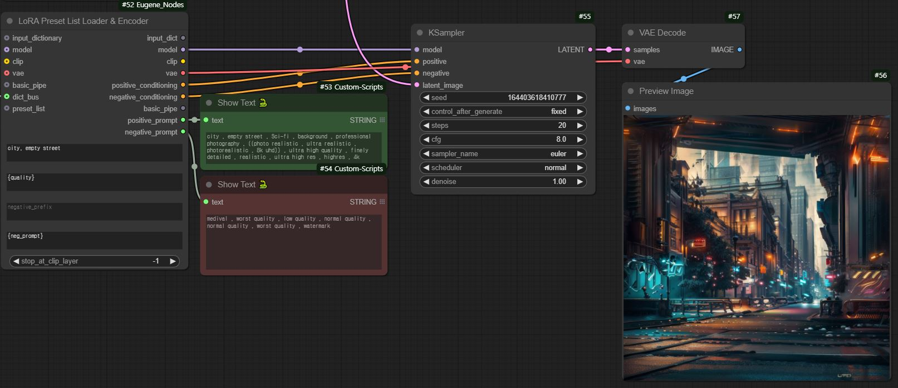

# Eugene's ComfyUI Custom Utility Nodes

A collection of utility nodes designed to optimize and manage workflows in ComfyUI.

## Dictionary-Based Prompt Management
Utility nodes for systematically managing and reusing prompt texts using Python Dictionaries.

### Dictionary Nodes


- **DictUpdate1**
  - Adds/updates a single key-value pair in a dictionary.
  - Creates a new dictionary if no input dictionary is provided.
  - Ignores empty keys or values.

- **DictUpdate5**
  - Adds/updates up to 5 key-value pairs simultaneously.
  - Creates a new dictionary if no input dictionary is provided.
  - Automatically ignores empty keys or values.
  - All fields are optional.

- **DictUpdate10**
  - Adds/updates up to 10 key-value pairs simultaneously.
  - Creates a new dictionary if no input dictionary is provided.
  - Automatically ignores empty keys or values.
  - All fields are optional.

- **DictTemplate**
  - Applies dictionary values to a template text.
  - Supports multi-line text.
  - Syntax: placeholders are defined as `{key}`.
  - Example:


- **DictMultilineSelect**
  - Selects specific lines from multi-line text and adds them to a dictionary.
  - Input:
    - Existing dictionary.
    - Line number to select.
    - Multi-line text.
    - New key string.
  - Output: Updated dictionary and selected line number.

### Dictionary Bus Nodes


Utility nodes for managing dictionaries alongside model components (MODEL, CLIP, VAE, etc.).

- **DictBus**
  - Bundles a dictionary with model components into a single unit.
  - Required inputs: dictionary, model, clip, vae.
  - Optional inputs: image, latent.
  - Allows multiple components to be passed as a single connection in workflows.

- **DictBusUnpack**
  - Separates a DictBus bundle into individual components.
  - Outputs all components (dictionary, model, clip, vae, image, latent) individually.
  - The original bus is also outputted for continued use.

- **DictBusEdit**
  - Selectively modifies specific components of a DictBus bundle.
  - Unmodified components retain their original values.
  - Allows for updating specific components mid-workflow.

## LoRA Preset Management
Nodes for managing and applying LoRA models and prompts as presets.

### Preset Management Nodes


- **LoraPresetSaver**
  - Saves up to 5 LoRA settings as a preset file.
  - Configurable options for each LoRA:
    - LoRA model selection.
    - Strength adjustment.
    - CLIP strength adjustment.
    - Positive/negative prompts.
    - Alias (nickname) assignment.
  - Presets are saved in JSON format.

- **LoraPresetSelector**
  - Selects and manages saved LoRA presets as a list.
  - Supports a subfolder-based preset structure.
  - Provides real-time preset refresh functionality.
  - Offers dynamic preset management via a web interface.
  - Bypass option for selective application.
  - Maintains a list of selected presets.

### LoRA Loader Nodes



- **Lora Preset Loader & Encoder**
  - Applies up to 5 LoRA presets simultaneously.
  - Allows individual adjustment of each LoRA's strength.
  - Supports prompt prefixes/suffixes.
  - Compatible with Dictionary-based prompt templates.
  - Allows CLIP layer adjustments.
  - Works with Dictionary Bus and Basic Pipe.



- **Lora Preset List Loader & Encoder **
  - Directly uses the output list from PresetSelector.
  - Sequentially applies multiple LoRAs.
  - Uses settings saved in the preset.
  - Compatible with Dictionary Bus and Basic Pipe.
  - Supports prompt prefixes/suffixes.

### **NOTE: Override**
When multiple inputs are connected to a node, the following override rules are applied:

1. **Priority 1:** Direct input to the node.
2. **Priority 2:** Input from `basic_pipe`.
3. **Priority 3:** Input from `dict_bus`.

#### **Example**
If the `model` is connected to the node via `dict_bus`, `basic_pipe`, and directly to the node, the model directly connected to the node will be used.

----

## Installation
1. Clone this repository into the `custom_nodes` directory of ComfyUI.
2. Restart ComfyUI.

## Additional Information
### Web Interface
Provides web API endpoints for managing LoRA presets:
- `/lora_presets`: Retrieves information about all available presets.
- `/lora_presets/refresh`: Forces a refresh of the preset list.

### Preset Directory Structure
Presets are managed within the LoRA folder in the following structure:
```
loras/
├── preset1_preset.json
├── category1/
│   ├── preset2_preset.json
│   └── preset3_preset.json
└── category2/
    └── preset4_preset.json
```

### Preset File Structure
```json
{
    "lora_name": "model_name.safetensors",
    "lora_path": "/path/to/lora",
    "strength": 1.0,
    "clip_strength": 1.0,
    "prompt_positive": "positive prompt text",
    "prompt_negative": "negative prompt text",
    "nickname": "Display Name"
}
```

## Usage Examples
- **Workflows**: Refer to the examples in the `./workflows` directory.
- **Presets**: Presets are generated automatically, but you can also refer to `./Sci-fi_Enviroments_preset.json` for inspiration.